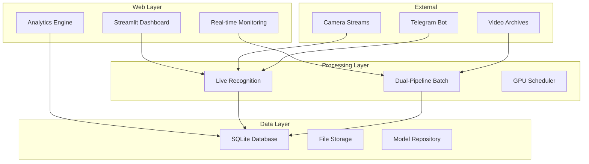

# LSR_SKUD - Advanced License Plate Recognition System


LSR_SKUD is a comprehensive license plate recognition and access control system that combines real-time camera processing with high-performance batch video analysis. The system features a modern web interface, advanced analytics, and enterprise-grade architecture.

## 🌟 Key Features

### Real-Time Recognition
- **Live camera processing** with sub-second response times
- **Multiple camera support** with individual configuration
- **Automatic gate control** integration
- **Telegram bot notifications**

### High-Performance Batch Processing
- **Dual-pipeline architecture** for maximum throughput
- **GPU acceleration** with NVIDIA CUDA support
- **Up to 1000+ files/hour** processing capacity
- **Intelligent video format detection**

### Advanced Analytics
- **Real-time performance monitoring**
- **Comprehensive usage analytics**
- **Processing trend analysis**
- **Custom reporting and exports**

### Modern Web Interface
- **Streamlit-based dashboard** with real-time updates
- **Interactive charts and visualizations**
- **Mobile-responsive design**
- **Dark/light theme support**

## 🏗️ Architecture



## 🚀 Quick Start

### Prerequisites

- **Python 3.11+**
- **Docker and Docker Compose**
- **NVIDIA GPU** (optional but recommended)
- **8GB+ RAM**
- **50GB+ free storage**

### Installation

1. **Clone the repository**
   ```bash
   git clone <repository-url>
   cd LSR_SKUD
   ```

2. **Configure environment**
   ```bash
   cp .env.example .env
   # Edit .env with your settings
   ```

3. **Deploy with Docker Compose**
   ```bash
   # CPU-only deployment
   ./deploy/deploy.sh production
   
   # GPU-enabled deployment
   ./deploy/deploy.sh production --gpu
   
   # With monitoring stack
   ./deploy/deploy.sh production --gpu --monitoring
   ```

4. **Access the interface**
   - Web Interface: http://localhost:8501
   - Prometheus: http://localhost:9090 (if monitoring enabled)
   - Grafana: http://localhost:3000 (if monitoring enabled)

### Manual Installation

```bash
# Install dependencies
uv sync --all-extras

# Configure environment
cp .env.example .env
# Edit .env file

# Run the application
uv run streamlit run app.py
```

## 📊 Performance

### Benchmark Results
- **Live Recognition**: 30-60 FPS per camera
- **Batch Processing**: 500-1000+ files/hour
- **Database Queries**: 1000+ queries/second
- **Web Interface**: <200ms response time

### System Requirements

#### Minimum
- CPU: 4 cores
- RAM: 8GB
- Storage: 50GB
- GPU: Optional

#### Recommended (Production)
- CPU: 8+ cores
- RAM: 16GB+
- Storage: 100GB+ SSD
- GPU: NVIDIA GPU with 8GB+ VRAM

## 🎯 Usage

### Live Recognition

1. **Configure Cameras**
   - Navigate to Settings → Cameras
   - Add camera streams (RTSP/HTTP)
   - Set recognition parameters

2. **Monitor Activity**
   - View live recognition events
   - Review detection accuracy
   - Manage access permissions

### Batch Processing

1. **Configure Processing**
   - Set input video directories
   - Adjust worker counts based on hardware
   - Configure confidence thresholds

2. **Start Processing**
   ```bash
   # Via web interface
   Navigate to Batch Processing → Start Job
   
   # Via command line
   ./batch_processing/manage_videos.sh start /path/to/videos
   ```

3. **Monitor Progress**
   - Real-time processing dashboard
   - Performance metrics
   - Result exports

### Analytics

- **Performance Dashboard**: System resource utilization
- **Processing Analytics**: Throughput and accuracy trends
- **Usage Patterns**: Peak times and volume analysis
- **Custom Reports**: Exportable analytics data

## 🔧 Configuration

### Key Configuration Options

```bash
# .env file
ANPR_INPUT_DIRECTORIES=/mnt/video/CAM_01,/mnt/video/CAM_02
ANPR_CPU_WORKERS=8
ANPR_GPU_WORKERS=4
ANPR_CONFIDENCE_THRESHOLD=0.25
GPU_ENABLED=true
TORCHSCRIPT_ENABLED=true
```

### Advanced Configuration

- **Database Settings**: Connection pooling, transaction management
- **Performance Tuning**: Worker counts, memory limits, GPU allocation
- **Integration Options**: Telegram bot, Parsec SKUD, external APIs
- **Security Settings**: Access control, encryption, audit logging

## 🧪 Development

### Development Setup

```bash
# Install development dependencies
make install-dev

# Run tests
make test

# Run with coverage
make test-coverage

# Performance benchmarks
make benchmark

# Code formatting
make format

# Type checking
make type-check
```

### Project Structure

```
LSR_SKUD/
├── app.py                  # Main Streamlit application
├── config/                 # Configuration management
├── db/                     # Database layer
├── batch_processing/       # High-performance batch processing
├── recognition/           # Live recognition pipeline
├── monitoring/            # Performance monitoring
├── analytics/             # Analytics engine
├── pages/                 # Web interface pages
├── tests/                 # Test suite
├── benchmarks/            # Performance benchmarks
├── deploy/                # Deployment configurations
└── docs/                  # Documentation
```

### Testing

```bash
# Run all tests
pytest

# Integration tests only
pytest tests/integration/

# Performance benchmarks
python benchmarks/anpr_performance.py

# GPU tests (requires GPU)
pytest -m gpu
```

## 🚀 Deployment

### Docker Compose (Recommended)

```yaml
# docker-compose.yml
services:
  lsr-skud:
    image: lsr-skud:latest
    ports:
      - "8501:8501"
    volumes:
      - ./data:/app/data
      - ./models:/app/models
      - /mnt/video_archive:/mnt/video_archive:ro
    environment:
      - GPU_ENABLED=true
      - ANPR_CPU_WORKERS=8
```

### Kubernetes

```bash
# Deploy to Kubernetes
kubectl apply -f deploy/production.yaml

# Scale deployment
kubectl scale deployment lsr-skud-app --replicas=3

# Monitor status
kubectl get pods -l app=lsr-skud
```

### Production Considerations

- **Load Balancing**: Multiple web interface instances
- **High Availability**: Database replication and failover
- **Monitoring**: Prometheus and Grafana integration
- **Security**: TLS encryption, access controls, audit logging
- **Backup**: Automated data backup and recovery

## 📈 Monitoring

### Built-in Monitoring

- **Real-time Dashboard**: System status and performance
- **Performance Metrics**: Processing speed and accuracy
- **Resource Utilization**: CPU, memory, GPU usage
- **Error Tracking**: Failed processing and error analysis

### External Monitoring (Optional)

- **Prometheus**: Metrics collection and alerting
- **Grafana**: Custom dashboards and visualizations
- **Log Aggregation**: Centralized log management
- **Health Checks**: Automated system monitoring

## 🔒 Security

### Security Features

- **Container Security**: Non-root user, minimal attack surface
- **Access Control**: Role-based permissions
- **Data Encryption**: Database and file encryption
- **Audit Logging**: Complete activity tracking

### Security Best Practices

- Regular security updates
- Strong authentication
- Network isolation
- Secure configuration management

## 🤝 Contributing

### Development Guidelines

1. **Code Style**: Follow PEP 8 and use provided formatters
2. **Testing**: Maintain >80% test coverage
3. **Documentation**: Update docs for new features
4. **Performance**: Benchmark significant changes

### Contribution Process

1. Fork the repository
2. Create a feature branch
3. Implement changes with tests
4. Run quality checks
5. Submit pull request

## 📚 Documentation

### Available Documentation

- **[Architecture Guide](docs/architecture.md)**: System architecture and design
- **[User Guide](docs/user_guide.md)**: Complete user manual
- **[Deployment Guide](deploy/README.md)**: Production deployment instructions
- **[API Documentation](docs/api.md)**: REST API reference

### Additional Resources

- **Performance Benchmarks**: Detailed performance analysis
- **Configuration Reference**: Complete configuration options
- **Troubleshooting Guide**: Common issues and solutions
- **Development Guide**: Contributing and extending the system

## 🐛 Troubleshooting

### Common Issues

**GPU Not Detected**
```bash
# Check GPU availability
nvidia-smi
docker run --rm --gpus all nvidia/cuda:11.0-base nvidia-smi
```

**Out of Memory**
```bash
# Reduce worker counts
ANPR_CPU_WORKERS=4
ANPR_GPU_WORKERS=2
```

**Permission Errors**
```bash
# Fix permissions
sudo chown -R 1000:1000 data/
```

### Getting Help

- **Check Logs**: Application and system logs for error details
- **Performance Dashboard**: Monitor resource usage
- **Test Configuration**: Verify settings and connectivity
- **Community Support**: GitHub issues and discussions

## 📄 License

This software is proprietary. See LICENSE file for details.

## 🙏 Acknowledgments

- **YOLO**: Vehicle and license plate detection models
- **EasyOCR**: Optical character recognition
- **Streamlit**: Web interface framework
- **OpenCV**: Computer vision processing
- **PyTorch**: Machine learning framework

---

**LSR_SKUD** - Advanced License Plate Recognition System for Professional Use

For support and inquiries, please contact the development team.