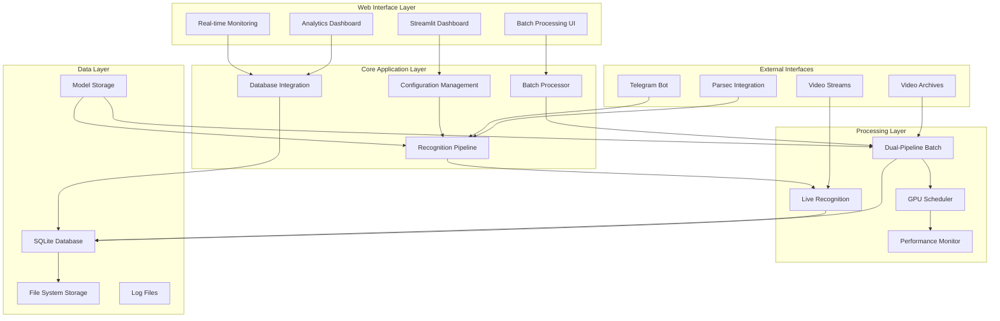
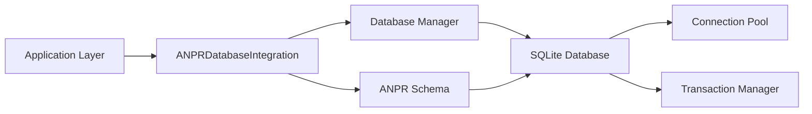
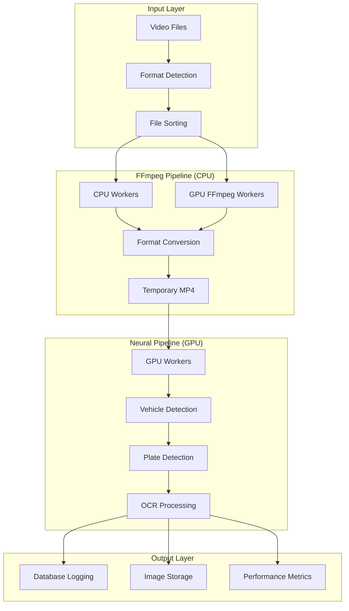
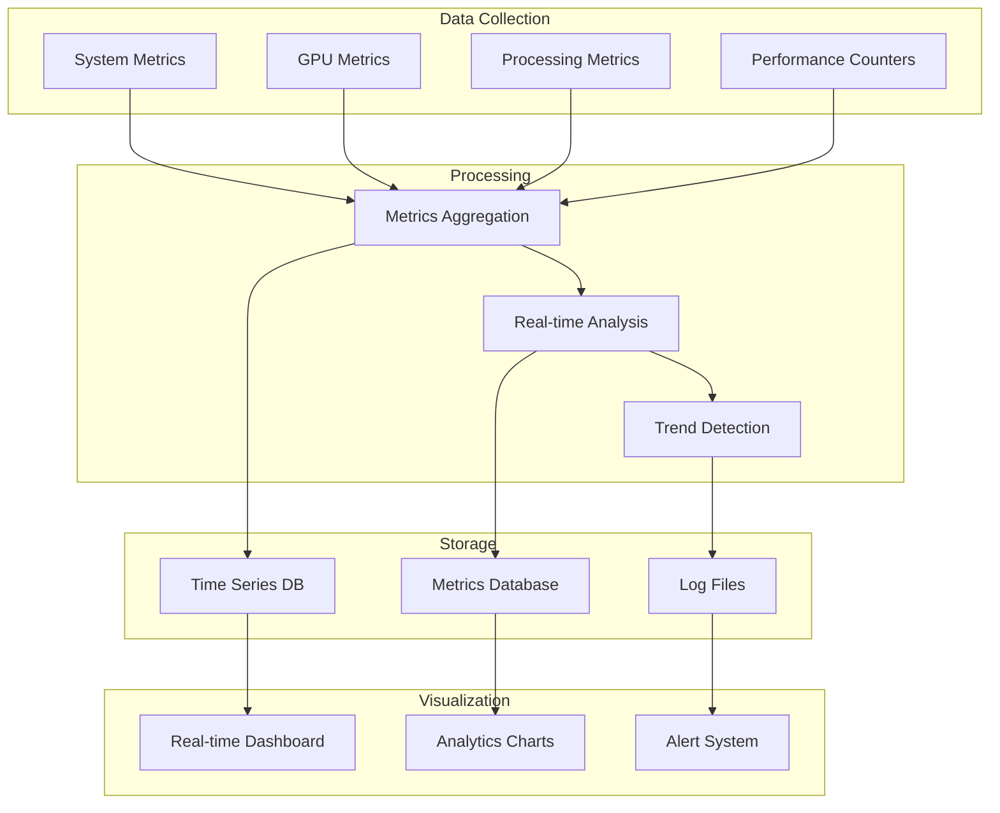
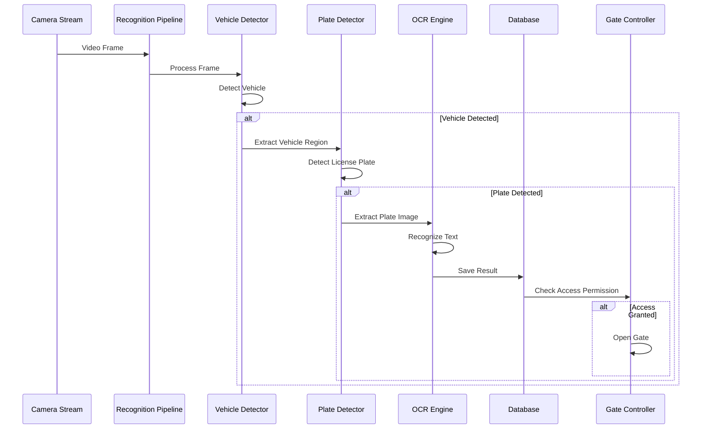
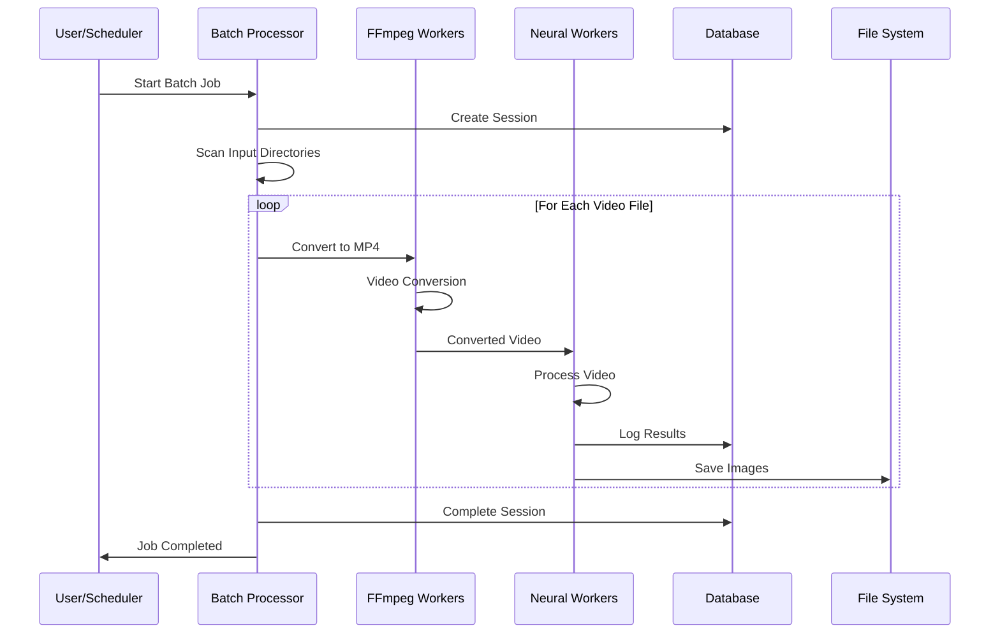
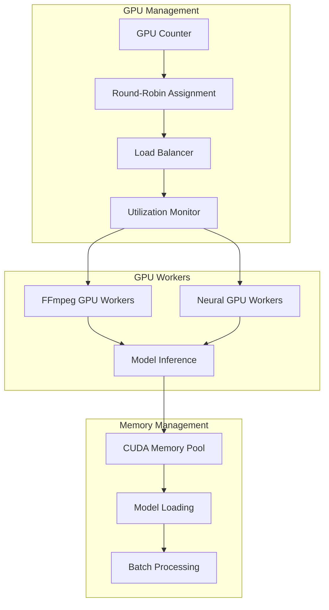
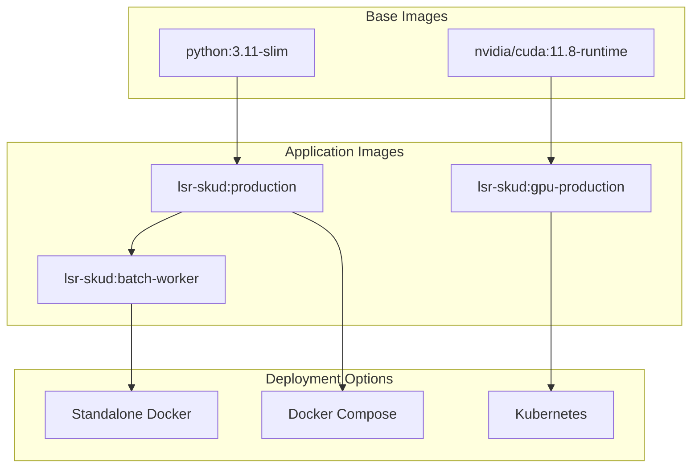
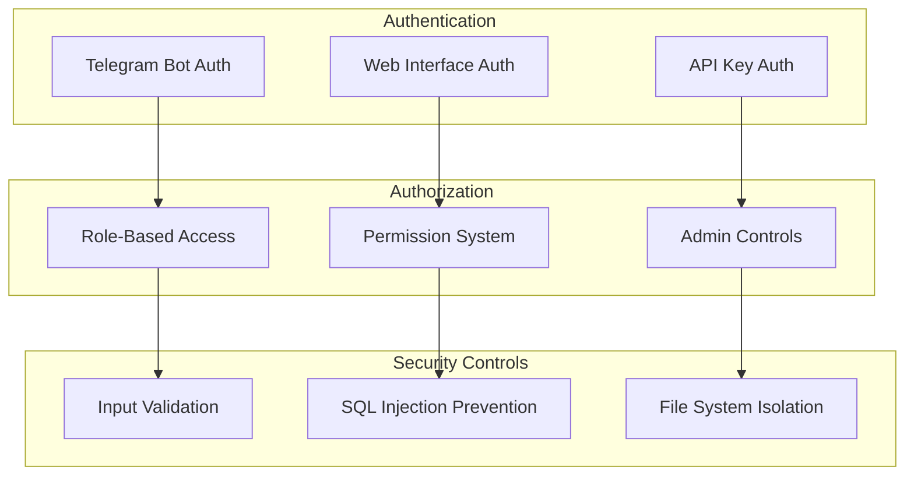
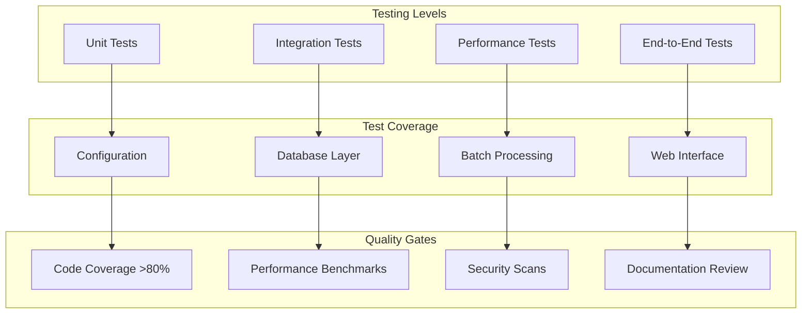

# LSR_SKUD + ANPR Integrated Architecture

## Overview

This document describes the integrated architecture combining LSR_SKUD's enterprise features with ANPR's high-performance batch processing capabilities, creating a unified system for license plate recognition and access control.

## System Architecture

### High-Level Architecture



## Core Components

### 1. Configuration Management System

**Location:** `config/` directory
**Key Files:** `config.py`, `anpr_config.py`

#### Features
- **Dataclass-based configuration** with type safety
- **Environment variable integration** for containerization
- **Validation and error handling**
- **Configuration inheritance** for different environments

#### Example Configuration Structure
```python
@dataclass
class Config:
    # Core settings
    db_path: str = "data/gate_control.db"
    models_dir: str = "models"
    
    # ANPR integration
    anpr_batch: ANPRBatchConfig = field(default_factory=ANPRBatchConfig)
    
    # Performance settings
    torchscript_enabled: bool = True
    half_precision: bool = True
```

### 2. Database Integration Layer

**Location:** `db/` directory
**Key Files:** `database.py`, `anpr_schema.py`, `anpr_integration.py`

#### Architecture


#### Key Features
- **Thread-safe singleton pattern** with connection pooling
- **ACID transaction management** with context managers
- **Automated schema creation** and migration
- **Performance metrics logging**
- **Data lifecycle management** with cleanup policies

#### Database Schema
```sql
-- Batch processing sessions
CREATE TABLE batch_processing_sessions (
    id INTEGER PRIMARY KEY,
    session_id TEXT UNIQUE,
    start_time TIMESTAMP,
    end_time TIMESTAMP,
    status TEXT,
    config_snapshot TEXT
);

-- Processing results
CREATE TABLE batch_processing_results (
    id INTEGER PRIMARY KEY,
    session_id TEXT,
    file_path TEXT,
    plate_text TEXT,
    confidence REAL,
    processing_time REAL,
    timestamp TIMESTAMP
);
```

### 3. Dual-Pipeline Batch Processing

**Location:** `batch_processing/` directory
**Key Files:** `batch_processor.py`, `neural_worker.py`

#### Architecture Innovation
The system implements a **revolutionary dual-pipeline architecture** that separates CPU-intensive video conversion from GPU-intensive neural processing:



#### Performance Characteristics
- **Throughput**: Up to 1000+ files/hour (hardware dependent)
- **Scalability**: Linear scaling with CPU/GPU worker count
- **Reliability**: Process isolation prevents cascade failures
- **Efficiency**: Eliminates GPU idle time during video conversion

### 4. Performance Monitoring System

**Location:** `monitoring/` directory
**Key Files:** `batch_metrics.py`

#### Monitoring Architecture


## Data Flow

### 1. Live Recognition Flow



### 2. Batch Processing Flow



## Performance Architecture

### GPU Resource Management

The system implements sophisticated GPU resource management:



### Memory Optimization

- **TorchScript models** for faster inference
- **Half-precision inference** to reduce memory usage
- **Model sharing** across workers
- **Efficient memory pooling**

## Integration Points

### 1. Configuration Integration

All components share a unified configuration system:

```python
# Single configuration object used throughout the system
config = Config.from_env()

# Components access their specific configuration
batch_config = config.anpr_batch
recognition_config = config.recognition_settings
```

### 2. Database Integration

Shared database instance with specialized schemas:

```python
# Main database for live recognition
db = get_db(config.db_path)

# ANPR integration layer for batch processing
anpr_integration = ANPRDatabaseIntegration(db)
```

### 3. Monitoring Integration

Unified monitoring across all components:

```python
# Performance monitor for batch processing
monitor = PerformanceMonitor(anpr_integration)

# Real-time metrics for dashboard
metrics = monitor.get_current_metrics(session_id)
```

## Deployment Architecture

### Container Strategy



### Scalability Architecture

#### Horizontal Scaling
- **Multiple web interface instances** behind load balancer
- **Distributed batch processing** across multiple nodes
- **Database connection pooling** for concurrent access

#### Vertical Scaling
- **Dynamic worker allocation** based on system resources
- **Automatic GPU detection** and utilization
- **Memory-aware processing** with configurable limits

## Security Architecture

### Authentication & Authorization



### Data Security

- **Database encryption** at rest
- **Secure file permissions** for sensitive data
- **Log sanitization** to prevent information leakage
- **Container security** with non-root users

## Performance Characteristics

### Throughput Metrics

| Component | Metric | Typical Performance |
|-----------|---------|-------------------|
| Live Recognition | Frames/second | 30-60 FPS |
| Batch Processing | Files/hour | 500-1000+ |
| Database Queries | Queries/second | 1000+ |
| Web Interface | Response Time | <200ms |

### Resource Requirements

#### Minimum Requirements
- **CPU**: 4 cores
- **RAM**: 8GB
- **Storage**: 50GB
- **GPU**: Optional (CPU fallback available)

#### Recommended Production
- **CPU**: 8+ cores
- **RAM**: 16GB+
- **Storage**: 100GB+ SSD
- **GPU**: NVIDIA GPU with 8GB+ VRAM

## Extensibility

### Plugin Architecture

The system is designed for extensibility:

```python
# Custom detector plugins
class CustomPlateDetector(PlateDetector):
    def detect(self, frame):
        # Custom detection logic
        pass

# Custom processing plugins
class CustomBatchProcessor(ModernBatchProcessor):
    def process_video(self, video_path):
        # Custom processing logic
        pass
```

### API Extensions

- **REST API** for external integrations
- **WebSocket** for real-time updates
- **Webhook** support for notifications

## Quality Assurance

### Testing Strategy



### Monitoring & Observability

- **Application metrics** via Prometheus
- **Custom dashboards** in Grafana
- **Health checks** for all components
- **Distributed tracing** for request flows

## Future Architecture

### Planned Enhancements

1. **Microservices Architecture**
   - Service mesh implementation
   - Independent scaling of components
   - Improved fault isolation

2. **Machine Learning Pipeline**
   - Automated model training
   - A/B testing for model versions
   - Federated learning capabilities

3. **Real-time Processing**
   - Stream processing with Apache Kafka
   - Event-driven architecture
   - Real-time analytics

4. **Cloud Native Features**
   - Kubernetes operators
   - Helm charts for deployment
   - Cloud storage integration

## Conclusion

The LSR_SKUD + ANPR integrated architecture represents a modern, scalable, and high-performance solution for license plate recognition and access control. The innovative dual-pipeline design ensures optimal resource utilization while maintaining system reliability and extensibility.

Key architectural strengths:
- **Performance**: Dual-pipeline design maximizes throughput
- **Scalability**: Linear scaling with hardware resources
- **Reliability**: Process isolation and graceful error handling
- **Maintainability**: Clean architecture with proper separation of concerns
- **Extensibility**: Plugin architecture for future enhancements